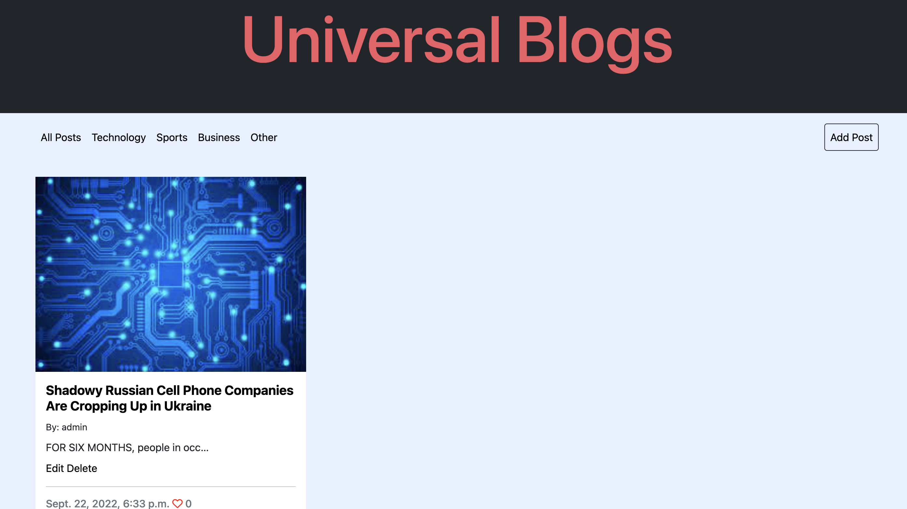
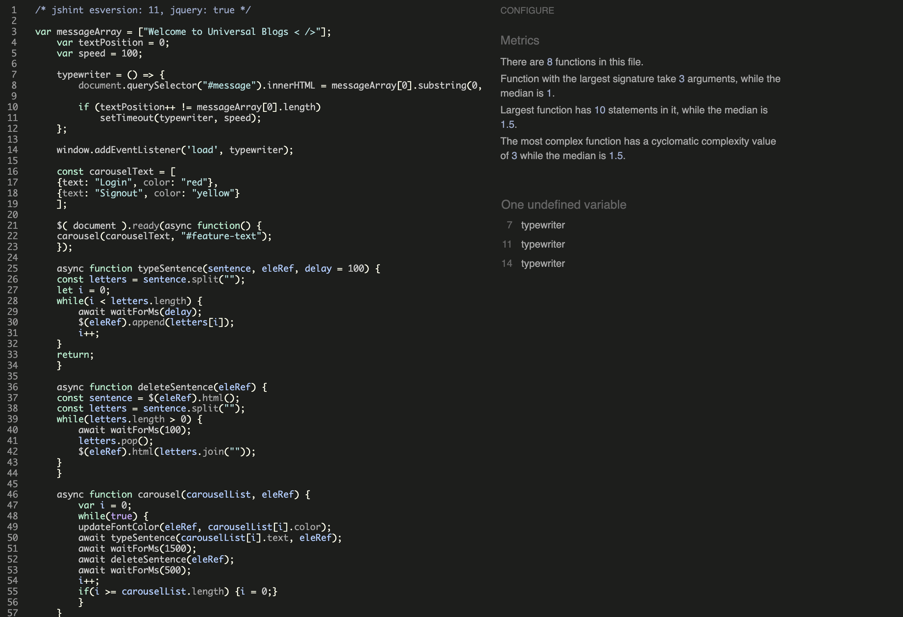

# Universal Blogs

## Introduction
Universal Blogs is a website that shares articles on any topic the user wants to post about. The main topics are Technology, Sports, Business, if the user wants to search for a less popular topic they can browse the other article category or search for the article in the search bar.

This website allows all users to be able to post, add, edit and delete their posts. All they need is an account which they will have to sign up for.

## Preview

### Live Website
To visit the deployed website click [here](https://universal-blogs-project-4.herokuapp.com/)

# Table of Contents
- [Table of Contents](#table-of-contents)
- [Introduction](#introduction)
- [UX](#ux-user-experience)
- [Agile Development Process](#agile-development-process)
- [Design](#design)
- [Features](#features)
- [Technologies Used](#technologies-used)
- [Testing](#testing)
- [Deployment](#deployment)
- [Credits](#credits)
- [Acknowledgements](#acknowledgements)

## UX User Experience
### User Stories

### Site Admin/Creator:
* Restrict users access to users that have not been registered [GitHub Issue 1](https://github.com/Ewicks/universal-blogs-project-4/issues/1)

* Superuser will have full access [GitHub Issue 2](https://github.com/Ewicks/universal-blogs-project-4/issues/2)

### Site User
* Able to sign up and create an account to access certain functionality.

* Be able to create, edit, delete, comment, like and unlike posts.

* To be able to search up any article using the search bar. [GitHub Issue 3](https://github.com/Ewicks/universal-blogs-project-4/issues/3)

* As a user I can view a paginated list of posts. [GitHub Issue 4](https://github.com/Ewicks/universal-blogs-project-4/issues/4)

* Each post will have a category which will make it easier to find the article [GitHub Issue 5](https://github.com/Ewicks/universal-blogs-project-4/issues/5)

* A user can only edit or delete their own posts [GitHub Issue 6](https://github.com/Ewicks/universal-blogs-project-4/issues/6)

* If the user gets a 404 error page, a page will display with a back button which redirects them to the blog page [GitHub Issue 7](https://github.com/Ewicks/universal-blogs-project-4/issues/7)

### Agile Methodology

I used GitHubs Projects Kanban Board to plan out this project which can be viewed [here](https://github.com/users/Ewicks/projects/2/views/1)

## Design
### Wireframes

  
Click here to view all wireframes both Desktop & mobile:

  
  
  
  
  

  

### Database Schema

The Post table is used when the user wants to create a article and post it on the website.

The Comment table is used when users add a comment to a post.

The Contact table is used when users submit the form in the contact us page.

  

## features 

### navbar

- I have created a navbar with a signin and logout button which is displayed when the user is not logged in. When the user logs in, those two buttons disappear and will be replaced with a Signout button. 

### Home Page

- If the user is not logged in, a sign up button will appear on the home page. This button will be replaced with a sign out button if user is logged in.

### About Page

- The About page displays illustrations and instructions on how to create a blog post.

### Blog Page

- This page displays all blog posts that have been posted. At the end of the page there is category and latest post widget.

- If there if more than 6 posts on this page, then page navigation will appear below the posts section, allowing the user to press next, previous or final pape depending on how many articles there are.

### Contact Page

- If the user enters all the details, the form will then allow them to submit the infomation which will be stored in the django database which can be accesed via an admin account.

### Article Page

- The Article page displays the fulll article, along with the a comments section and the ability to like a post.

### Topic Page

- When the user searches for an article or keyword, all the posts related to this search will appear making it easy for the user to find a specific article if there are many artciles on the blog page.

### Add Post

- The user will have to fill in all the details apart from the image before the form will allow the user to submit their post. After they pressed submit, the post will be added the first post on the first page and will be previewed in the latest post widget.

### Edit Post

- The user can edit their posts to there liking as many times as they want.

### Signup Page

- If the user has already got an account, they can press the login link to be directed to the login page.

### Login Page

- If the user has not created an account, the details they use to log in will not work.

### Admin Page with Superuser Access

### Contact Page Django Admin

- All Contact forms details will be stored in the contact section on the admin page in django, this includes the name, email and body of the message.

### 404 Error Page

- This page provides a link to direct them back to the website if user gets a  navigational page error.

### Default Images 

- If the user does not submit an image, a default image will be displayed depending on what topic the user chooses. If the user chooses technology as the topic, the technology image will be displayed within that post. This prevents posts having no image to be displayed.

### Future Features

- Allowing the user to filter posts by how many likes and comments each post has.

- Allow each user to only edit or delete the posts they created.

- Create a section where a user can donate money too support the ongoing publications.

### Bugs/Errors encountered during development

* Postgress database url link changed in Heroku on it's own, so I copied and pasted the new one into the env.py file.

* The blog post images was displaying locally but not in Heroku, so instead of using the dynamic image pathing, I uploaded the images to Cloudinary and used the url to display them within a if statement to get them working on Heroku.

* This is isn't a bug but I changed the add post and edit post views from class based views to function based views, becuase they are shorter, cleaner and works well in this instance. 

* Missing comma at the end of this line "STATICFILES_DIRS = [os.path.join(BASE_DIR, 'static'), ]" in manage.py.

* When the user is using a smaller device, the row of images would become a column of images. I needed to swap the middle two div's around so that the step title was above the image where as in the image below it is below. I used to order porperty in the media query section to swap them around on 800px width.

* I used JavaScript so that when the user would hover over the bottom half of a post, the title would change color. This was only working for the first post, so I used CSS instead which is a easier way of doing this as seen in the image below

* When the user clicks on the add post button, the form would display with the error This field is required on each field on the form when the user has not submitted the form yet. This was becuase in views.py addd_post function I was referencing 'post_form' before assignment. My function was not handling GET requests, so I added the else block to handle this, so that when the form loads without any errors because the user has not made a post request yet. See image belo

* When the user hovered over one of the navbar page elements that takes the user to a new page. For example, the blog button, all the page elements would move up 2 pixels when I hovered over one of them. To fix this I gave the class border-line a transparent border-bottom of 2px so that when the hover effect appears 2px border-bottom isn't added, instead it will be replaced with the red color via the hover css below.

## Technologies Used

Languages Used
- [HTML5](https://developer.mozilla.org/en-US/docs/Glossary/HTML5)
- [CSS3](https://developer.mozilla.org/en-US/docs/Web/CSS)
- [JavaScript](https://developer.mozilla.org/en-US/docs/Web/JavaScript)
- [Python](https://www.python.org/)

Frameworks, Libraries & Programs Used

- [amiresponsive](https://ui.dev/amiresponsive) to display the responsive website image on different size devices.
- [Balsamiq](https://balsamiq.com) to create wireframes.
- [Cloudinary](https://cloudinary.com) used to upload, store, manage, minipulate and provide images.
- [Django](https://www.djangoproject.com) is a free open-source Python web framework that follows the model-template-views architectural pattern.
- [Font Awesome](https://fontawesome.com) used to display icons for asthetic purposes
- [Git](https://git-scm.com) is version control software which can be used via the Gitpod terminal to commit and push to GitHub
- [Github](https://github.com) is used to store projects containing code
- [Gitpod](https://www.gitpod.io) is a online IDE linked to the GitHub repository used to write this project
- [Google Chrome Dev tools](https://developer.chrome.com/docs/devtools/) used for debugging code
- [Heroku](https://www.heroku.com) is used to deploy this project. Heroku is a cloud platform as a service supporting several programming languages.
- [JQuery](https://jquery.com/) is a JavaScript library designed to simplify HTML DOM tree traversal and manipulation

## Testing

### The W3C Markup Validator

Home Page

About Page

Blog Page

Contact Page

Signup Page

Topic Page

Search Posts Page

### CSS Validation

### Python Validation

Here are the files within the Blog App.

Admin 

Forms

Models

Urls

Views

### Javascript Validation

Index Page

- I have used Jquery within this section which jshint does not account for.

Update Page

### Browser Compatibility

There are no Compatibility issues that I am aware of.

### Chrome

- Mobile Size

- Desktop Size

### Safari

- Tablet Size

- Tablet Size

### Responsiveness

There are no Responsiveness issues that I am aware of.

- Desktop

- Tablet Size

- Mobile Size

## Deployment

* Log in to [Heroku](https://id.heroku.com/login) or create an account
* On the main page click New and Create New App
* Note: new app name must be unique
* Next select your region, I chose Europe.
* Click Create App button
* Click in resources and select Heroku Postgres database
* Click Reveal Config Vars and add new config "SECRET_KEY"
* Click Reveal Config Vars and add new config "CLOUDINARY_URL"
* Click Reveal Config Vars and add new config "DISABLE_COLLECTSTATIC = 1"
* The next page is the project’s Deploy Tab. Click on the Settings Tab and scroll down to Config Vars
* Next, go to Buildpack section click Add Buildpack select python and Save Changes
* Scroll to the top of the page and choose the Deploy tab
* Select Github as the deployment method
* Confirm you want to connect to GitHub
* Search for the repository name and click the connect button
* Scroll to the bottom of the deploy page and select the preferred deployment type
* Click either Enable Automatic Deploys for automatic deployment when you push updates to Github
* Create a requirements.txt in the root directory file so Heroku can install the packages needed.
* To update requirements.txt with all package installments type the command in the terminal "pip3 freeze --local > requirements.txt"
* To obtain the Postgres DATABASE_URL from Heroku, navigate to the resources tab in your app, under the title Add-ons search for Heroku Postgres, submit this option. The DATABASE_URL will be added to config bars automatically.
* To obtain a cloudinary key, navigate to your cloudinary accounts details under the Dashboard tab. Add the url to the cloudinary config var.
* In GitPod create a file called env.py in the root directory.
* Import os in the env.py file then type os.environ["WRITE_KEY_HERE"] = "VALUES_GO_HERE"
* Fill in the above line with the "SECRET_KEY", "CLOUDINARY_URL" AND "DATABASE_URL". The values for each key are found in the config vars in Heroku.

### Final Deployment 

* Create a runtime.txt `python-3.8.13`
* Create a Procfile `web: gunicorn heardit.wsgi`
* When development is complete change the debug setting to: `DEBUG = False` in settings.py
* In this project the summernote editor was used so for this to work in Heroku add: `X_FRAME_OPTIONS = SAMEORIGIN `to
   settings.py.
* In Heroku settings, delete the config vars for `DISABLE_COLLECTSTATIC = 1`

### Forking This Project

* Open [GitHub](https://github.com/Ewicks/universal-blogs-project-4)
* Find the 'Fork' button at the top right of the page
* Once you click the button the fork will be in your repository
* Create a requirements.txt in the root directory file so Heroku can install the packages needed.
* To update requirements.txt with all package installments type the command in the terminal "pip3 freeze --local > requirements.txt"

### Cloning This Project

* Clone this project by following the steps:

* Open [GitHub](https://github.com/Ewicks/universal-blogs-project-4)
* You will be provided with three options to choose from, HTTPS, SSH or GitHub CLI, click the clipboard icon in order
to copy the URL
* Once you click the button the fork will be in your repository
* Open a new terminal
* Change the current working directory to the location that you want the cloned directory
* Type 'git clone' and paste the URL copied in step 3
* Press 'Enter' and the project is cloned
* Create a requirements.txt in the root directory file so Heroku can install the packages needed.
* To update requirements.txt with all package installments type the command in the terminal "pip3 freeze --local > requirements.txt"

## Credits

* Code Institute "I think therefore i blog" - Django blog project Walkthrough
* Codemy.com blog post tutorials using django - [Youtube playlist](https://www.youtube.com/playlist?list=PLCC34OHNcOtr025c1kHSPrnP18YPB-NFi)
* W3Schools, youtube clips and stackoverflow resources helped my throughout the project
* [link](https://www.youtube.com/watch?v=h_Uv_9OxA2k) to video for typewriter effect
* Images were taken from [Google Images](https://images.google.com/)

## Acknowledgements
* I used Code Institute's material in the Full Stack Development course.
* W3Schools, youtube clips and stackoverflow resources helped my throughout the project
* Tim - Code Institute mentor

This project is for educational use only and was created for the Code Institute Module.

Created by Ethan Wicks

